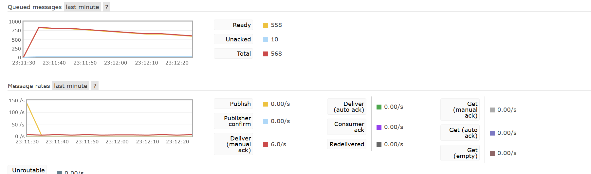
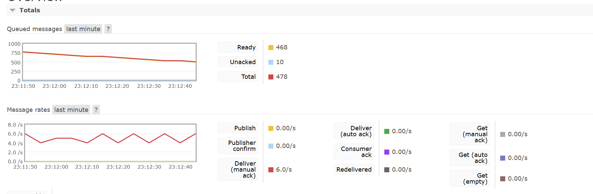

# Classic_Seckill
 A classic seckill using SpringBoot, RabbitMQ and Redis.

- current method: Pessimistic Locking, use synchronized lock to control concurrency.
- running results:

It is proved that the system can handle 1000 requests in 1 second.

